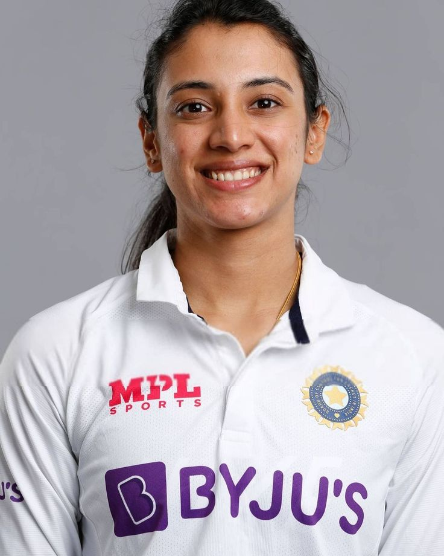
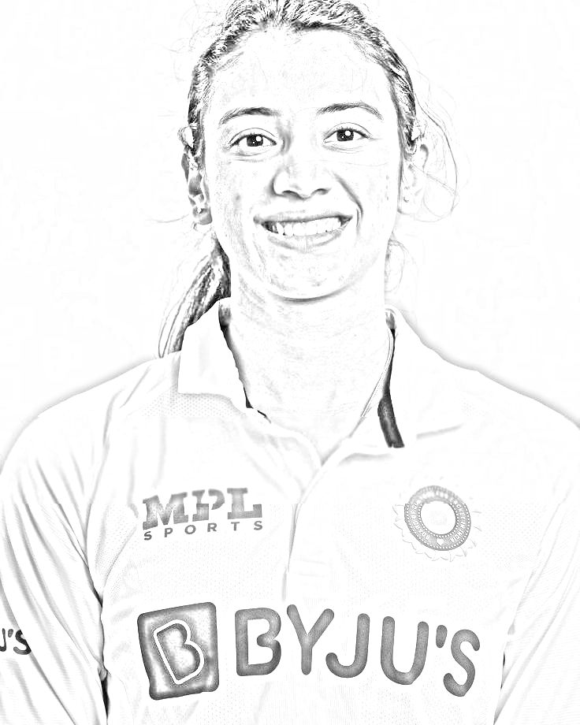
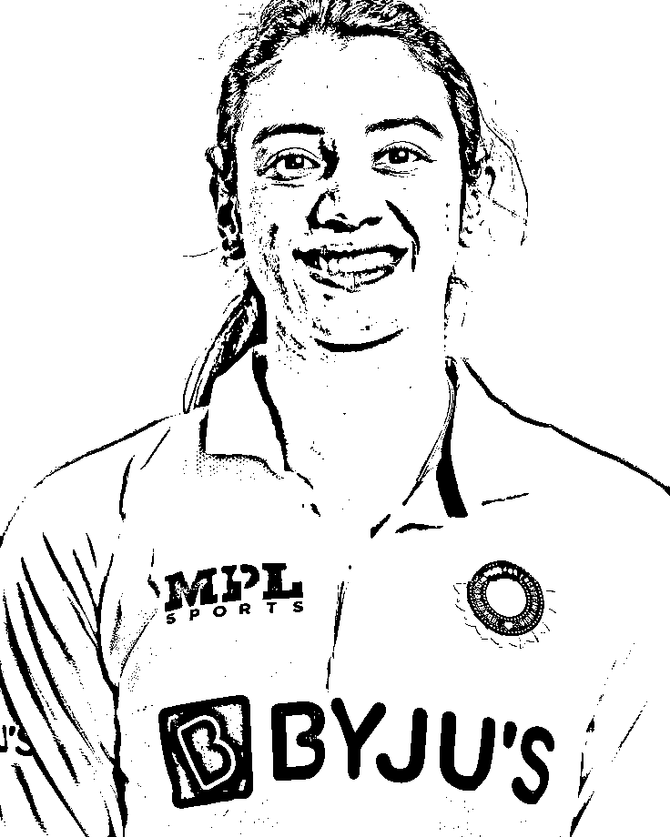
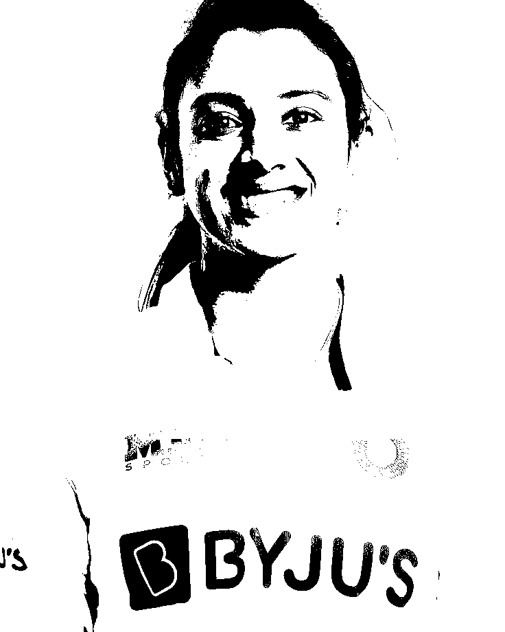

# 🖼️ Image Art Effects Generator (MLOps Powered)

🚀 **Live Demo:** https://image-art-mlops.onrender.com/docs

---

## 📌 Overview...

This project is a **FastAPI-based Image Processing API** that converts images into:

* ✏️ Pencil Sketch
* 🖋️ Ink Sketch
* 🎨 Cartoon Effect

It is deployed on the cloud using **Render** and follows an **MLOps-style pipeline**.

---

## ⚡ Features

✅ Upload any image and get stylized outputs
✅ Real-time API processing
✅ Deployed on cloud (public access)
✅ Clean modular code structure
✅ Logging support
✅ Scalable backend using FastAPI

---

## 🧠 Tech Stack

* 🐍 Python
* ⚡ FastAPI
* 🧮 NumPy
* 🖼️ Pillow
* 📊 SciPy
* ☁️ Render (Deployment)

---

## 🏗️ Project Structure

```
image-art-mlops/
│
├── app/
│   ├── main.py        # API endpoints
│   ├── model.py       # Image processing logic
│
├── outputs/           # Generated images
├── logs/              # Application logs
├── requirements.txt
└── README.md
```

---

## 🚀 API Endpoints

### 🔹 1. Pencil Sketch

```
POST /sketch
```

### 🔹 2. Ink Sketch

```
POST /ink
```

### 🔹 3. Cartoon Effect

```
POST /cartoon
```

👉 Access full API docs:
👉 https://image-art-mlops.onrender.com/docs

---

## 📷 How It Works

1. Upload image
2. Convert to grayscale
3. Apply transformations (invert, blur, dodge)
4. Generate stylized output

---

## 🔥 Sample Outputs

| Original | Sketch | Ink | Cartoon |
|----------|--------|-----|---------|
|  |  |  |  |

---

## 🛠️ Installation (Local Setup)

```bash
git clone https://github.com/KhushiSingh2216/image-art-mlops.git
cd image-art-mlops
pip install -r requirements.txt
uvicorn app.main:app --reload
```

---

## 🌐 Deployment

Deployed using:

* Render Cloud Platform

---

## 📈 Future Improvements

* 🎨 Add frontend UI (Streamlit)
* 📦 Docker containerization
* 📊 Monitoring & logging dashboard
* 🤖 AI-based advanced filters

---

## 🙋‍♀️ Author

**Khushi Singh**
🔗 GitHub: https://github.com/KhushiSingh2216

---

## ⭐ If you like this project

Give it a ⭐  and share!

---
